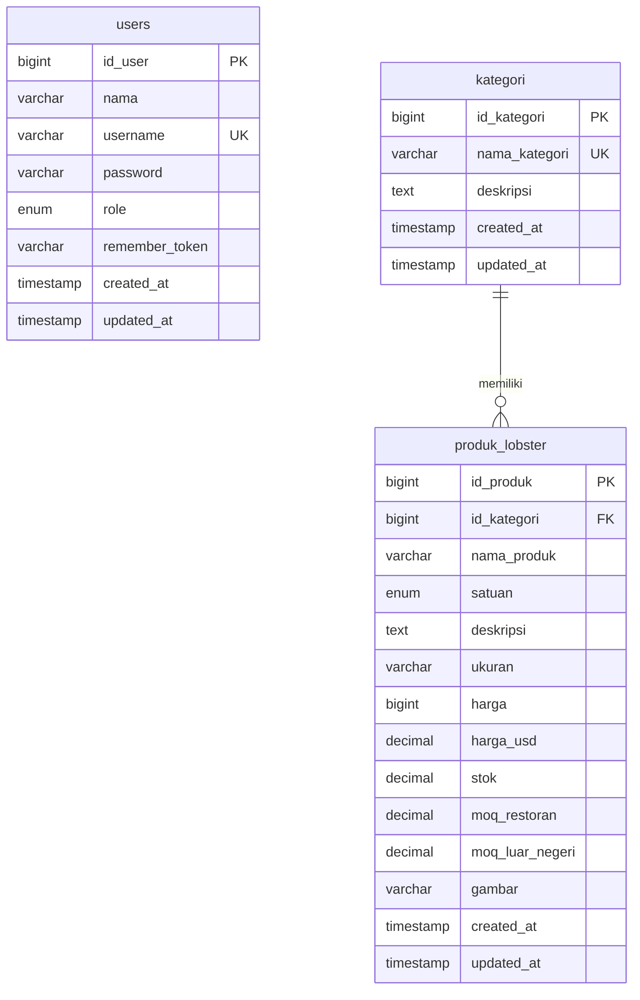

# Skema Database Tamafarm

Skema ini mengikuti migration dan model proyek Tamafarm. Database lokal memakai SQLite. Tipe pada kamus data mengikuti deklarasi migration Laravel; SQLite menyimpan beberapa tipe dengan aturan afinitasnya sendiri. File `schema-database.sqlite.sql` berisi struktur SQL aktual tanpa data akun, produk, atau token.

## ERD tabel utama



PK = primary key, FK = foreign key, UK = unique key. Satu kategori dapat memiliki nol atau banyak produk; setiap produk wajib memiliki satu kategori. `users` belum memiliki relasi langsung ke kategori atau produk karena proyek belum menyimpan pembuat/pengelola pada kedua tabel tersebut.

## Kamus data

### Tabel `users`

Menyimpan akun pemilik dan admin.

| Kolom | Tipe pada migration | Boleh NULL | Aturan / keterangan |
| --- | --- | --- | --- |
| id_user | BIGINT UNSIGNED | Tidak | PK, auto increment |
| nama | VARCHAR(255) | Tidak | Nama pengguna |
| username | VARCHAR(255) | Tidak | Unik, digunakan untuk login |
| password | VARCHAR(255) | Tidak | Hash password |
| role | ENUM('admin', 'pemilik') | Tidak | Peran akun |
| remember_token | VARCHAR(100) | Ya | Token remember me Laravel |
| created_at | TIMESTAMP | Ya | Waktu dibuat |
| updated_at | TIMESTAMP | Ya | Waktu diperbarui |

Pemilik mengelola akun admin. Admin mengelola kategori dan produk. Hak akses ini diterapkan pada route dan middleware aplikasi.

### Tabel `kategori`

Mengelompokkan produk, misalnya Lobster Hidup dan Paket Kemitraan.

| Kolom | Tipe pada migration | Boleh NULL | Aturan / keterangan |
| --- | --- | --- | --- |
| id_kategori | BIGINT UNSIGNED | Tidak | PK, auto increment |
| nama_kategori | VARCHAR(255) | Tidak | Unik; API membatasi input hingga 100 karakter |
| deskripsi | TEXT | Ya | Penjelasan kategori |
| created_at | TIMESTAMP | Ya | Waktu dibuat |
| updated_at | TIMESTAMP | Ya | Waktu diperbarui |

### Tabel `produk_lobster`

Menyimpan katalog, harga, stok, dan batas minimal pemesanan.

| Kolom | Tipe pada migration | Boleh NULL | Aturan / keterangan |
| --- | --- | --- | --- |
| id_produk | BIGINT UNSIGNED | Tidak | PK, auto increment |
| id_kategori | BIGINT UNSIGNED | Tidak | FK ke kategori.id_kategori |
| nama_produk | VARCHAR(100) | Tidak | Nama produk |
| satuan | ENUM('kg', 'paket') | Tidak | Satuan penjualan |
| deskripsi | TEXT | Ya | Penjelasan produk |
| ukuran | VARCHAR(50) | Ya | Keterangan ukuran lobster |
| harga | BIGINT UNSIGNED | Tidak | Harga rupiah; bilangan bulat |
| harga_usd | DECIMAL(10,2) | Ya | Harga dalam dolar AS |
| stok | DECIMAL(10,2) | Tidak | Default 0 |
| moq_restoran | DECIMAL(8,2) | Ya | Minimal order restoran |
| moq_luar_negeri | DECIMAL(8,2) | Ya | Minimal order luar negeri |
| gambar | VARCHAR(255) | Ya | Path file gambar |
| created_at | TIMESTAMP | Ya | Waktu dibuat |
| updated_at | TIMESTAMP | Ya | Waktu diperbarui |

## Relasi dan aturan

- `produk_lobster.id_kategori` mengacu ke `kategori.id_kategori` dengan `ON DELETE RESTRICT`. Kategori yang masih memiliki produk tidak dapat dihapus.
- `username` dan `nama_kategori` masing-masing harus unik.
- Nilai `role` terbatas pada `admin` atau `pemilik`; `satuan` terbatas pada `kg` atau `paket`.
- API mensyaratkan harga dan stok tidak negatif. Untuk satuan `kg`, kedua MOQ wajib diisi dan minimal 1. Untuk satuan `paket`, API mengosongkan kedua MOQ dan harga USD. Aturan ini ada di aplikasi, bukan seluruhnya di constraint database.
- `gambar_url` merupakan atribut hasil perhitungan model dari path `gambar`, sehingga bukan kolom database.
- Proyek saat ini berupa katalog dengan pemesanan melalui WhatsApp; belum ada tabel pelanggan, pesanan, detail pesanan, atau pembayaran.

## Tabel pendukung Laravel

Untuk ERD bisnis tugas, tiga tabel utama di atas dapat digunakan. Untuk dokumentasi database lengkap, sertakan tabel berikut; struktur seluruh kolom tersedia dalam file SQL pendamping.

| Tabel | Primary key | Fungsi / relasi |
| --- | --- | --- |
| personal_access_tokens | id | Token API Sanctum; relasi polimorfik tokenable_type + tokenable_id ke model pengguna, tanpa FK langsung |
| sessions | id | Sesi; user_id nullable dan berindeks, tanpa constraint FK di migration |
| password_reset_tokens | email | Token reset password bawaan; akun aplikasi menggunakan username dan tidak memiliki kolom email |
| cache | key | Penyimpanan cache |
| cache_locks | key | Lock cache |
| jobs | id | Antrean pekerjaan |
| job_batches | id | Kelompok pekerjaan |
| failed_jobs | id | Riwayat pekerjaan gagal; uuid unik |
| migrations | id | Riwayat migration Laravel |

## Menggunakan file SQL

`schema-database.sqlite.sql` ditujukan untuk database SQLite baru/kosong. File ini berisi perintah pembuatan tabel dan indeks, tanpa INSERT dan tanpa DROP. Jangan gunakan sebagai skrip impor MySQL karena dialek SQL berbeda.

Contoh dengan CLI SQLite, jika tersedia:

```sh
sqlite3 tugas-tamafarm.sqlite ".read schema-database.sqlite.sql"
```
